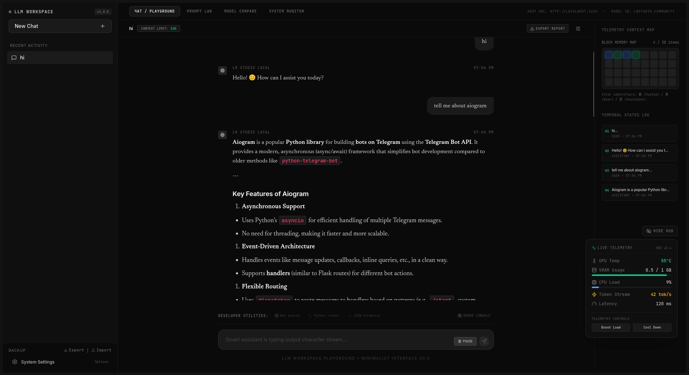

# 🧠 AI Local Dashboard

A local AI-powered dashboard for chatting with LLMs and monitoring system performance in real time.

Built for local models like LM Studio, with a focus on usability, performance tracking, and developer experience.

---

## 🚀 Features (v1.0)

- 💬 Chat interface for local LLMs (LM Studio supported)
- 🔢 Token counter (prompt + response)
- 🧠 System resource monitoring (CPU / RAM / GPU usage)
- ⚡ Response speed tracking (tokens/sec)
- 🗂 Chat history (saved locally via SQLite)
- 🎛 Model selection support
- 🔥 Presets for temperature, top_p, max_tokens
- 🌙 Dark theme UI
- 💾 Local persistence using SQLite database

---

## 🧱 Tech Stack

### Frontend
- React
- Tailwind CSS

### Backend
- Python
- SQLite

### AI Integration
- LM Studio API (local LLM server)

---

## 🖥️ What this project does

This project turns your local AI model into a usable developer dashboard.

Instead of just chatting with a model, you can:

- Track how your system performs under load
- Compare different models
- Monitor token usage
- Save and revisit conversations
- Tune generation parameters in real time

---

## 📸 Preview

---

## ⚙️ Installation

# clone repo
git clone https://github.com/yourname/ai-local-dashboard

cd ai-local-dashboard

# frontend
npm install
npm run dev

# backend
cd backend
pip install -r requirements.txt
python main.py
